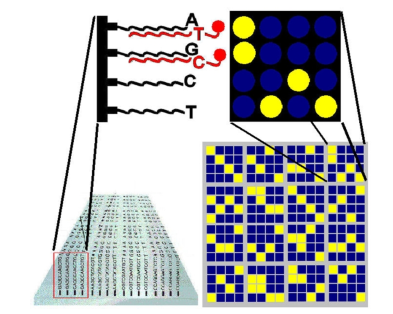

## 2.1. The Concept of the Genome

### Summary
- The genome includes the entire genetic information of an organism, usually encoded in DNA.
- DNA has a double helix structure with a sugar-phosphate backbone and nitrogenous base pairs: adenine (A) with thymine (T), and guanine (G) with cytosine (C). A-T pairs have two hydrogen bonds, G-C pairs have three.
- DNA is composed of nucleotides, which include deoxyribose (a five-carbon sugar), a phosphate group, and one of the four bases (A, T, G, C). These nucleotides are connected by phosphodiester bonds between the 3' OH of one sugar and the 5' OH of the next.
- The sequence of these bases determines genetic information.
- DNA and associated proteins (histones) form chromatin, which compacts into chromosomes during cell division.
- Human cells are diploid, containing two sets of chromosomes (homologous chromosomes). Gametes (sperm and eggs) are haploid, with one set of chromosomes.
- Humans have 23 pairs of chromosomes, totaling 46: 22 pairs of autosomes and one pair of sex chromosomes (X and Y).
- Homologous chromosomes have the same genes at specific loci but may have different alleles (gene variations).
- Individuals can be homozygous (identical alleles) or heterozygous (different alleles) for specific genes.
- Phenotypes, or observable traits, are determined by genotype and environmental factors.

### Important
- The structure of DNA and the concept of alleles are fundamental in understanding genetics and bioinformatics.
- Knowledge of chromosome types (diploid vs. haploid) and their roles in inheritance is crucial.
- The distinction between dominant and recessive alleles is essential for predicting phenotypic outcomes.

### Definitions
- **Genome**: The complete set of genetic information in an organism.
- **DNA**: Deoxyribonucleic acid, a molecule with a double helix structure containing genetic instructions.
- **Nucleotide**: The basic unit of DNA, consisting of deoxyribose, a phosphate group, and a nitrogenous base.
- **Chromatin**: The DNA-protein complex that condenses into chromosomes during cell division.
- **Diploid**: Cells with two sets of chromosomes.
- **Haploid**: Cells with one set of chromosomes.
- **Homologous Chromosomes**: Chromosomes that carry the same genes but may have different alleles.
- **Homozygous**: Having two identical alleles for a gene.
- **Heterozygous**: Having two different alleles for a gene.
- **Phenotype**: The observable characteristics of an organism resulting from the interaction of genotype and environmental factors.

## 2.2. The Genotype as the "Genetic Identity of the Individual"

### Summary
- The genotype broadly describes the genetic composition of an individual, determined by the information in their genome, specifically the DNA sequence.
- In a narrower sense, the genotype refers to the variations of a specific gene or a group of genes. The combination of these variations constitutes a genotype, which influences the phenotype of the individual.
- Genotyping involves determining the genotype of an individual, usually partially.
- The genetic composition of populations can be characterized by the frequency of different genotypes within the population and the allele frequencies derived from these genotypes.

### Important
- Understanding both the broad and specific definitions of genotype is crucial for studying genetics.
- Genotyping and allele frequency analysis are key methods for understanding genetic variation within populations.

### Definitions
- **Genotype**: The genetic constitution of an individual, encompassing all the genetic variations in their genome or specific genes.
- **Genotyping**: The process of determining the genotype of an individual.
- **Allele Frequency**: The proportion of a particular allele among all allele copies in a population.

## 2.2.1. Single Nucleotide Polymorphism (SNP)

### Summary
- Mutations are changes or errors that occur during DNA replication. Most mutations are spontaneous, though some can be induced by mutagens.
- The most common allele, which typically results in the characteristic phenotype, is called the wild type.
- Mutations can alter the DNA sequence to varying extents, affecting a single base, a gene segment, or even an entire chromosome or chromosome set.
- A variation in the DNA sequence where a single nucleotide changes is known as a single nucleotide polymorphism (SNP). If more than 1% of a population has this nucleotide variation at a specific position, it is classified as an SNP.
- The key difference between a point mutation found in an individual and an SNP found in a significant portion of a population is their frequency.

- SNPs can occur in coding and non-coding regions of genes, as well as in intergenic regions of DNA. 
- If an SNP occurs in a gene’s coding region, it can affect the amino acid sequence of the protein product, potentially altering its structure and function.
- SNPs in non-coding regions can influence processes such as splicing, transcription factor binding, or mRNA degradation.

### Important
- SNPs are a major source of genetic variation and can impact both coding and non-coding regions of the genome.
- Understanding the distinction between point mutations and SNPs is crucial for genetic studies and applications.

### Definitions
- **Mutation**: A change or error in the DNA sequence that can occur spontaneously or be induced by mutagens.
- **Wild Type**: The most common allele in a population that typically results in the characteristic phenotype.
- **Single Nucleotide Polymorphism (SNP)**: A variation in the DNA sequence where a single nucleotide differs among individuals in a population, defined as an SNP if it occurs in more than 1% of the population.
- **Coding Region**: The portion of a gene that codes for protein.
- **Non-Coding Region**: The portion of a gene or genome that does not code for protein but can affect gene expression and other regulatory functions.
- **Intergenic Region**: The DNA sequence located between genes.

## 2.2.2. Possible Variations of Point Mutations

### Summary
- Point mutations involve a change in a single nucleotide in the DNA molecule, which can occur through substitution, deletion, or insertion.
- **Substitution**: One base is replaced by another. This can be further categorized into:
  - **Transition**: A purine is replaced by another purine (e.g., A-G) or a pyrimidine by another pyrimidine (e.g., T-C).
  - **Transversion**: A purine is replaced by a pyrimidine (e.g., A-T) or a pyrimidine by a purine (e.g., C-G).
- The consequences of a point mutation largely depend on the importance of the position in the information transfer.
- **Silent Mutation**: A base change occurs, but it does not alter the amino acid sequence of the protein due to the redundancy in the genetic code, where multiple codons can code for the same amino acid.
- **Nonsense Mutation**: A codon that originally codes for an amino acid is changed to a stop codon, terminating protein synthesis prematurely.
- **Missense Mutation**: A nucleotide substitution leads to a different amino acid being incorporated into the protein, potentially affecting its structure and function.
- **Frameshift Mutation**: Caused by either a base deletion or insertion, which shifts the reading frame of the codons. This often results in altered amino acid sequences and can create or disrupt stop codons, leading to an incorrectly sized and structured protein.

### Important
- Understanding the different types of point mutations and their effects is essential for studying genetic diseases and protein function.
- Frameshift mutations can have severe consequences on protein synthesis due to the alteration of the entire amino acid sequence following the mutation.

### Definitions
- **Substitution**: A mutation where one base is replaced by another.
- **Transition**: A specific type of substitution where a purine is replaced by another purine, or a pyrimidine by another pyrimidine.
- **Transversion**: A substitution where a purine is replaced by a pyrimidine, or vice versa.
- **Silent Mutation**: A mutation that does not change the amino acid sequence of the protein due to the redundancy of the genetic code.
- **Nonsense Mutation**: A mutation that converts an amino acid codon into a stop codon, leading to premature termination of protein synthesis.
- **Missense Mutation**: A mutation that changes one amino acid in the protein sequence, potentially altering its function.
- **Frameshift Mutation**: A mutation caused by the insertion or deletion of a base, shifting the reading frame and altering the downstream amino acid sequence.

## 2.2.3. Effects of Mutations

### Summary
- Variants in human DNA affect how the body responds to diseases, bacteria, viruses, and chemicals.
- Mutations arise throughout an individual's life, with many being repaired by cellular mechanisms.
- Mutations contribute to evolution by allowing organisms to adapt to environmental changes.
- **Somatic Mutations**: Occur in body (somatic) cells and are not inherited. These mutations usually do not affect phenotype, but can lead to diseases like cancer if they disrupt genes involved in cell division.
- **Germline Mutations**: Occur in reproductive cells (sperm and eggs) and are inherited by offspring. These mutations can be detected in populations and can lead to genetic diseases.
- There are currently over 70 million known SNPs in human populations. Most SNPs do not cause any known harmful effects and increase genetic diversity.
- Some SNPs are associated with diseases or predispositions, such as sickle cell anemia, diabetes, cardiovascular diseases, vision problems, cancer (e.g., breast and ovarian cancer), and neurodegenerative diseases (e.g., Alzheimer's disease).
- SNPs play a key role in personalized medicine, helping in medical research and drug development, as they remain relatively stable across generations, allowing for linear conclusions about their prevalence in populations.

### Important
- Understanding the distinction between somatic and germline mutations is crucial for studying genetic diseases and inheritance.
- SNPs are essential in personalized medicine and drug development due to their role in genetic variation and disease predisposition.

### Definitions
- **Somatic Mutation**: A mutation that occurs in body cells and is not inherited by offspring.
- **Germline Mutation**: A mutation that occurs in reproductive cells and can be passed on to offspring.
- **SNP (Single Nucleotide Polymorphism)**: A genetic variation where a single nucleotide differs among individuals in a population, with some SNPs linked to diseases or predispositions.

## 2.3. Haplotypes

### Summary
- **Haplotype**: A combination of closely linked genetic markers inherited from one parent or found on one chromosome. It can also refer to markers on homologous chromosomes that are in the same gametic phase, defining which section comes from the paternal or maternal chromosome.
- Haplotypes help to narrow down the set of SNPs to be studied further and can be more powerful than SNP-based analyses for certain phenotypic traits, particularly complex diseases.
- **Determining Haplotypes**: 
  - **Family Tree Analysis**: Provides phased genotype data, though it can be costly and time-consuming, and is not suitable for diseases appearing later in life.
  - **PCR and Next-Generation Sequencing**: These methods can also determine haplotypes but come with high costs and time requirements.
  - **Computational Algorithms**: Use statistical methods to infer haplotypes from raw genotype data, though this approach can suffer from reconstruction uncertainty.
- Current research focuses on whether to produce haplotypes directly or infer them. Direct haplotypes are more powerful, but with larger sample sizes, higher genetic linkage (linkage disequilibrium, LD), and fewer markers, inferred haplotypes can also be effective.

### Important
- Understanding haplotypes and their determination methods is crucial for studying genetic variation and complex diseases.
- Directly obtained haplotypes generally provide more accurate results, but inferred haplotypes are useful under certain conditions, such as with larger sample sizes or higher genetic linkage.

### Definitions
- **Haplotype**: A set of closely linked genetic markers inherited from one parent or found on one chromosome; can also refer to markers on homologous chromosomes in the same gametic phase.
- **Linkage Disequilibrium (LD)**: The non-random association of alleles at different loci, often used to understand genetic linkage and haplotype structure.
- **Phased Genotype Data**: Information about which genetic variants are inherited together on the same chromosome, often obtained from family tree analysis or advanced sequencing techniques.

## 2.4. Linkage Disequilibrium

### Summary
- **Linkage Disequilibrium (LD)**: Describes the non-random association of alleles at different loci in a population. It's often visualized using a correlation matrix.
- **Correlation Matrix**: This matrix has markers on its diagonal, and the degree of linkage disequilibrium between markers is read from the rows and columns. 
- The matrix elements are color-coded to represent the strength of linkage disequilibrium.

### Important
- LD is crucial for understanding genetic associations and mapping complex traits.
- The correlation matrix helps visualize and quantify the strength of genetic associations.

### Definitions
- **Linkage Disequilibrium (LD)**: The non-random association of alleles at different loci.
- **Correlation Matrix**: A matrix used to represent the strength of linkage disequilibrium between genetic markers, with markers on the diagonal and color-coded elements showing the strength of associations.

## 2.5. Haplotyping Reconstruction

### Summary
- **Haplotyping Reconstruction**: Most SNP measurement technologies can't precisely determine haplotypes as they only provide discrete genotypes and can't identify whether they originate from paternal or maternal chromosomes.
- Identifying haplotypes is crucial, particularly when two variants affect the phenotype only if they are on the same chromosome. This allows for accurate determination of compound heterozygosity.
- Common methods for haplotype reconstruction include hidden Markov models. The most accurate and widely used method is **PHASE**, which estimates possible haplotypes using Gibbs sampling, given known genotypes and recombination rates.
- These methods can generally handle incomplete data.

### Important
- Accurate haplotype reconstruction is essential for understanding the effects of genetic variants on phenotypes.
- The PHASE method is particularly notable for its accuracy in estimating haplotypes.

### Definitions
- **Haplotype**: A set of genetic variants on a single chromosome that are inherited together.
- **Haplotype Reconstruction**: The process of determining the set of haplotypes from genotype data.
- **PHASE**: A method that uses Gibbs sampling to estimate haplotypes based on known genotypes and recombination rates.
- **Hidden Markov Model**: A statistical model used to infer haplotypes from genotype data.

## 2.6. Imputation

### Summary
- **Imputation**: In SNP measurements, not only can haplotypes be reconstructed using linkage disequilibrium, but imputation can also address missing or unreliable data. This is a common task in genetic association studies, with missing data ranging from 1% to 20%.
- Missing data complicates statistical analysis, so maximizing available genotype information is crucial.
- Imputation often involves using external data sources, ideally results from larger genetic association studies conducted in the same population.

### Important
- Imputation is essential for handling missing or unreliable genetic data, ensuring more accurate and comprehensive analysis.
- Using data from large-scale studies within the same population can enhance imputation accuracy.

### Definitions
- **Imputation**: The process of filling in missing or unreliable genetic data using external data sources or statistical methods.
- **Linkage Disequilibrium**: The non-random association of alleles at different loci, used in haplotype reconstruction and imputation.
- **Genetic Association Study**: Research aimed at identifying associations between genetic variants and traits or diseases.

## 2.7. Genotyping Methods

### Summary
- **Genotyping Methods**: Various platforms and methods are available for determining genotypes, differing significantly in throughput and accuracy.
- **Sample Preparation**: Most methods require several sample preparation steps. Polymerase Chain Reaction (PCR) is used to amplify a target DNA region from the entire genome. Typically, segments ranging from 100 to 10,000 base pairs are amplified.
- **PCR Process**: PCR exponentially increases the concentration of the targeted DNA region. The quantity of the amplified segment is limited by the amount of free reaction mixture available.
- **PCR Cycles**: In PCR, 20-40 repeated cycles of cooling and heating are performed, each involving specific steps.

### Important
- PCR is crucial for amplifying DNA segments before genotyping.
- Understanding the limits and specifics of PCR cycles is essential for accurate genotyping.

### Definitions
- **Genotyping**: The process of determining the genetic constitution of an individual by examining their DNA.
- **Polymerase Chain Reaction (PCR)**: A technique used to amplify specific DNA regions, increasing their concentration exponentially.
- **Amplification**: The process of increasing the quantity of a specific DNA segment.
- **Cycles**: Repeated series of heating and cooling steps in PCR to amplify the target DNA.

## 2.7.1. Sanger Sequencing

### Summary
- **Sanger Sequencing**: Also known as chain-termination sequencing, this method determines the precise base sequence of a DNA segment. Due to its high cost and low throughput, it is used primarily in diagnostic contexts where high reliability is required.

### Important
- Sanger sequencing provides accurate DNA sequences but is less commonly used due to its expense and limited capacity.

### Definitions
- **Sanger Sequencing**: A method for determining the exact sequence of bases in a DNA segment using chain-terminating dideoxynucleotides.

## 2.7.2. Real-Time Quantitative PCR

### Summary
- **Real-Time Quantitative PCR (qPCR)**: Allows for the accurate identification of SNPs and the assessment of SNP frequency distribution in a potentially heterogeneous population. It follows the general PCR steps but measures the relative amount of DNA copies after each PCR cycle. Despite its accuracy, qPCR has low throughput.

### Important
- qPCR provides precise quantification of DNA but is limited in throughput.

### Definitions
- **Real-Time Quantitative PCR (qPCR)**: A PCR method that measures the amount of DNA in real-time, allowing for the quantification of DNA and detection of SNP frequencies.

## 2.7.3. DNA Chips

### Summary
- **DNA Chips**: These consist of a solid surface (glass, silicon, or special plastic) with thousands of different nucleotide sequences. Each probe is 25-50 nucleotides long. Modern technology allows for millions of different probes on a chip with a surface area of 1-2 cm².

### Important
- DNA chips enable high-throughput analysis by allowing simultaneous examination of many SNPs or other genetic variants.

### Definitions
- **DNA Chips**: A technology that uses a solid surface to host thousands of different DNA probes for analyzing genetic variations.

### Process
1. **Sample Preparation**: DNA is isolated from samples and amplified using PCR to target specific areas of interest, such as SNPs.
2. **Labeling**: The amplified DNA is labeled with fluorescent dyes. Primers are used to ensure that the fluorescently labeled nucleotide is incorporated at specific sites adjacent to SNPs, distinguishing between wild-type and mutant alleles.
3. **Hybridization**: The labeled DNA samples are hybridized to the DNA chip, which contains complementary DNA sequences. Non-hybridized DNA is washed away.
4. **Detection**: The chip is illuminated with laser light at wavelengths specific to the fluorescent dyes, allowing for the detection of the different labeled DNA sequences.

## 2.7.3. High-throughput Genotyping

### Summary
- **High-throughput Genotyping**: DNA chips analyze multiple genetic variants simultaneously, providing a comprehensive overview of genetic information. The process involves using fluorescently labeled wild-type and mutant alleles. These fluorescent labels emit light at specific wavelengths, which are detected and analyzed. Images are captured under two different color channels, and the intensity of the signals is recorded.

### Important
- High-throughput genotyping allows for the simultaneous analysis of many SNPs and provides a detailed view of genetic variations.

### Definitions
- **High-throughput Genotyping**: A method using DNA chips to analyze numerous genetic variants at once. It involves detecting fluorescent signals from labeled alleles to determine the presence of specific mutations.

### Applications
- **Data Visualization**: After collecting data from the DNA chips, results are plotted on a diagram where the X-axis represents the sample color ratio, and the Y-axis represents the summed intensity of points. This plot helps determine if a mutation is present by observing the position of the data points on the diagram.
- **Cluster Analysis**: Results from multiple chips are analyzed using hierarchical clustering to group similar genetic patterns.

### Notes
- Various techniques exist for SNP determination using DNA chips. The described approach is one example of how high-throughput genotyping can be performed.

## 2.8. Genotyping and Gene Expression

### Summary
- **Genotyping**: Maps the variability of an organism's genetic material by determining different polymorphisms. It provides a qualitative measure of genotype, yielding a specific genetic profile.
- **Gene Expression Measurement**: Quantifies the amount of RNA transcribed from genes. This process yields a quantitative measure of RNA concentration, influenced by factors like tissue type and sample isolation conditions.

### 2.8.1. Measurement Success and Accuracy

#### Summary
- **Call Rate**: The ratio of successfully measured SNPs to all intended SNPs.
- **Accuracy**: The proportion of successfully measured SNPs where the assigned genotype matches the true genotype. Generally, methods with higher throughput have lower success rates and accuracy. Diagnostic tests often use low-throughput systems for higher accuracy, while modern genome-wide association studies (GWAS) can measure millions of SNPs simultaneously.

#### Important
- Measurement success and accuracy are influenced by sample quality, primer specificity, and measurement methods. Issues include failures due to poor DNA quality or non-specific primers.

### Definitions
- **Call Rate**: The proportion of SNPs successfully measured out of all SNPs intended to be measured.
- **Accuracy**: The ratio of correctly assigned genotypes to all successfully measured SNPs.

